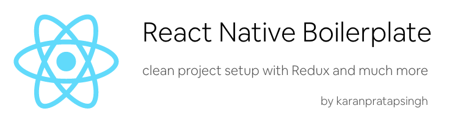

<p align="center">

</p>

This project is a [React Native](https://facebook.github.io/react-native/) boilerplate that  provides **an architecture optimized for building solid cross-platform mobile applications** through separation of concerns between the UI and business logic to help you kickstart your new app

When starting new apps I found myself repeatedly setting up my project with same packages over and over again so I decided to automate this process

This boilerplate consists of various elements and best practices I learned while going though apps written by various talented developers in the React Native Community :zap:

While this mostly consists of how I organize my projects but can be easily extended to suit any workflow :smile:

If you're new to React Native feel free to checkout a gist I made where I keep all the learning resources I find: [Learn React Native](https://gist.github.com/karanpratapsingh/51dc4e585439758eb6afcc90ede21880)

If you face any issue then please checkout the Known Issues section below, but if the issue persists then feel free to open a issue so we can solve it together :smiley:

**Feel free to leave a :star: as motivation if this was useful to you :smile:**

## Coming soon :fire:

* [ ] React Native Firebase
* [X] React Native 0.61.1
* [X] TypeScript support

## Index

   - [Content](#Content)

   - [Project Structure](#ProjectStructure)

   - [TypeScript Support (Beta)](#TypeScriptSupport)

   - [Using the boilerplate](#UsingBoilerplate)

   - [Rename the project](#RenameProject)

   - [Removing Redux](#RemovingRedux)

   - [Running the project](#RunningProject)

   - [Updates](#Updates)

   - [Known Issues](#KnownIssues)

## <a name="Content"></a> Content:

    - React Native (0.61.1) + Hermes
    - TypeScript Integration (Optional)
    - Clean Directory Layout
    - ESLint
    - Packages:
        - Redux (Thunk)
        - React Navigation (Hooks)
        - React Native Reanimated
        - React Native Vector Icons
        - React Native Gesture Handler

## <a name="ProjectStructure"></a> Project Structure:


## <a name="TypeScriptSupport"></a> TypeScript Support (Beta)

Recently I've been using a lot of TypeScript and I think it's fantastic :smiley: 
Addition of TypeScript to this boilerplate was a much requested feature from a lot of reddit users of [r/react-native](https://www.reddit.com/r/reactnative/)

To add TypeScript support please run `yarn run typescript:add` command which should excecute the `typescript.sh` script and install all the TypeScript dependencies with types for React, React Native, React Navigation and also add a `tsconfig.json` and `jest.config.js` 

If `yarn run typescript:add` fails then kindly apply the changes as mentioned in the [docs](https://facebook.github.io/react-native/docs/typescript) :sweat:

**Note**: This feature is in beta and only tested on Linux and MacOSX

## <a name="UsingBoilerplate"></a> Using the boilerplate:

Make sure to remove the existing git history and initialize the project with your own 

``` bash
rm -rf .git/
git init
git add .
git commit -m 'project init'
git remote add origin <your remote repo>
git push -u origin master
```

## <a name="RenameProject"></a> Rename the project:

Rename the project with the name and bundle identifier of your choosing
**Note**: it is advised to do so in a new branch

``` 
git checkout -b rename
yarn run rename <new_name> -b <bundle_identifier>
```

## <a name="RemovingRedux"></a> Removing Redux:

I personally like Redux for state management for larger apps but sometimes if the app is relatively smaller then I stick to using context api or simple `useState` or `useReducer` 

Checkout this great light weight Redux like implementation using just the `React Context` api: [No-Redux](https://github.com/RichardBray/no-redux)

If you like to use other great solutions such as MobX, RxJS then feel free to remove redux by using `yarn run redux:remove` 

**Note**: you will have to configure the project files accordingly :sweat_smile:

## <a name="RunningProject"></a> Running the project

Assuming you have all the requirements installed, you can setup and run the project by running:

* `yarn install` to install the dependencies

* use the following steps for your platform

### Android

Run the following command while the simulator is open or a device is connected via adb.

``` 
yarn run android
```

### iOS

Run the following commands to install pods and run the app on iPhone 6 simulator (device can be changed via `package.json` scripts)

``` 
yarn run cocoapods
yarn run ios
```

## <a name="Updates"></a> Updates

The boilerplate will follow latest React Native releases as soon as libraries and tools used here are compatible. I will personally try update this as I use this boilerplate in production :smile:

### <a name="KnownIssues"></a> Known Issues:

**Cocoapods install fails**

`yarn run cocoapods` might fail for some users, if this happens then try deleting `Podlock.file` and re-running the `yarn run cocoapods` command :smile:

If the error persists then please check your cocoapods version using `pod --version` . It should be `>= 1.7.5` . If not then please run `sudo gem install cocoapods` :smiley: 

